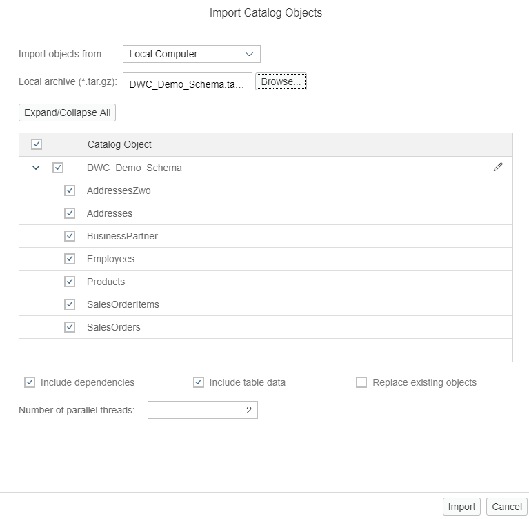
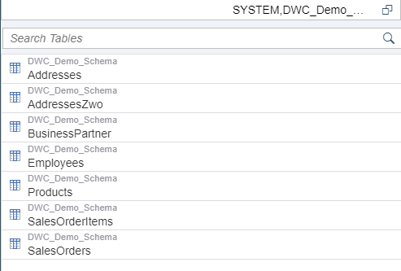
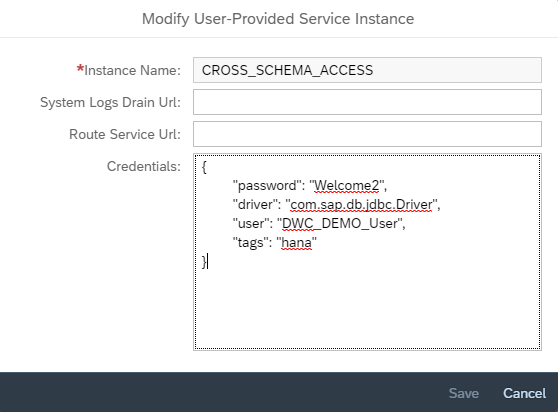

# Readme

### Steps for importing DB objects

* Download the DB schema file - [DWC\_Demo\_Schema.tar.gz](https://github.com/kulkarniamogh/DWC_Demo/blob/master/db_setup/DWC_Demo_Schema.tar.gz?raw=true)
* From the Cloud Platform Cockpit, navigate to, your space -> Services -> Service Instances -> Name of your database (with hana-db service) -> Open Dashboard -> Go To SAP Hana Cockpit -> From the cockpit, go to Database Explorer
* You will find your Cockpit Resource Database in the list on the left side
* Under the DB, expand Catalog and then right click on **Schemas** and click on **Import Catalog Objects**
* Browse for the file **DWC\_Demo\_Schema.tar.gz**. As soon as you select the file, it will load all the DB objects. Here you can also set the name of the schema. It is recommended at this point to not change it as we would be using the schema name in further steps.



* Click on **Import**
* Once imported, you would be able to see all the tables under the **DWC\_Demo\_Schema** in the left-bottom window. Click on the **Tables** from top left menu. 



### Steps for creating database user, role and granting role to user


* Right click on the Cockpit Resource DB that you see in the top-left window and click on **Open SQL Console**. A new window would be opened in the workspace of the **Database Explorer**
* Copy-paste the commands from the file **/db_setup/scripts.sql** into the newly opened SQL console
* Select all the commands and click on the **Run** button in green (top-left of the SQL Console)
* It will execute all the commands quickly which will create an user **DWC\_DEMO\_User**, create a role **DWC\_DEMO\_ROLE**, grant the role to the newly created user and then grant a few other required privileges to this role.
* This role will also be granted later to the technical user of the HDI Container that is automatically created.
* You can check the newly created roles and users by running the following commands  
> select * from roles;  
> select * from users;

### Steps for creating User Provided Service for Cross Schema Access

In this demo, the database artifacts from our SAP Hana Database Project (i.e. Synonyms, Calc Views) would reside in its own HDI container whereas the database objects (i.e. DWC Demo Schema tables) would be present in a Hana DB outside the container. To facilitate the access from HDI container to the Hana DB, we need to create a service that takes care of the access and privileges.  

* Open your **SAP Cloud Platform Cockpit**
* Navigate to Your Space -> Services -> User-Provided Services 
* On the newly opened window, click on **New Instance**
* Enter the name of the instance as **CROSS\_SCHEMA\_ACCESS**
* In the credentials section, enter the following code:

```
{
	"password": "Welcome2",
	"driver": "com.sap.db.jdbc.Driver",
	"user": "DWC_DEMO_User",
	"tags": "hana"
}
```


* Click on **Save**

### Steps for Cloning the GIT Repository and deploying the project

* Open the **SAP Hana Web IDE-Full Stack** from your **SAP Cloud Platform Cockpit**
* From the left-menu, right click on **Workspace** and go to **Git -> Clone Repository**
* Enter the URL as [https://github.com/kulkarniamogh/DWC_Demo.git](https://github.com/kulkarniamogh/DWC_Demo.git)
* Click on **Clone**
* Once the cloning process is completed, you would be able to see the project **DWC\_Demo** under your Workspace
* Right-click on the project and go to **Project -> Project Settings**
* Under **Cloud Foundry**, point the project to a valid **Space** on your CF account by selecting the API Endpoint, Organization and Space.
* Click **Save** and then click **Close**
* Now right click on the folder **db** and go to **Build -> Build**

> Note that, you have to right click the **db** module and build it. This step deploys the artifacts in the project's HDI container by converting the design-time artifacts to run-time artifacts.

* Once build process is completed successfully, open the **Database Explorer**
* Click on the add sign (+) at the top of the left-side menu
* Under the **HDI Containers** list, you will see the newly deployed HDI container. Select it and click on **OK**
* It will be then added to the list of containers on your Database Explorer.
* As a part of our project, we have created **Synonyms** which you can check by navigating to the **Your HDI Container -> Synonyms**
* Navigate to **Your HDI Cotainer -> Column Views** and select **Sales Per Category** from the left-bottom window
* From the newly opened window, click on **Open Data** and then click on **Raw Data**
* You can also analyze the data under the **Analysis Tab**
